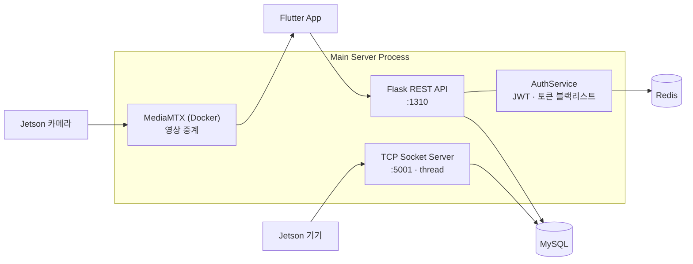

# 🏢 Bldg-Safety-AI :: Main Server (Backend)

> **딥러닝 기반 실시간 건물 구조 안전 진단 및 결함 탐지 시스템**의 백엔드 서버
>
> 엣지 디바이스(Jetson)가 촬영·추론한 구조물 결함 데이터를 수집하고, 위험도를 평가하며, 모바일 앱(Flutter)에 실시간으로 전달하는 중앙 서버입니다.

<p align="left">
  
  
  
  
  
  
</p>

---

## 📌 프로젝트 개요

노후 구조물의 안전사고 위험이 커지고 있으나, 기존 육안 검사는 비용과 고위험 구역 접근성에 한계가 있습니다. 이 프로젝트는 **엣지 디바이스 + Vision AI**로 구조물 결함(균열 등)을 실시간 자동 탐지하고, 서버가 이를 수집·평가·전달하는 파이프라인을 구축한 캡스톤 디자인 작품입니다.

이 저장소는 그중 **백엔드(Main Server)** 파트를 담습니다.

```
[Jetson 엣지 디바이스] --TCP 소켓--> [Main Server (본 저장소)] <--REST API--> [Flutter 모바일 앱]
   (촬영 + YOLO 추론)              (수집·평가·인증·중계)              (관제 UI)
```

**전체 시스템 구성**

| 파트 | 역할 | 기술 |
|------|------|------|
| AI / 학습 | 균열 객체 분할 모델 학습·추론 | YOLO11 (Seg), Depth Camera |
| **백엔드 (본 저장소)** | **API 서버, 인증, 기기 통신, DB, 영상 중계** | **Flask, SQLAlchemy, JWT, Redis, TCP Socket** |
| 프론트엔드 | 관제 모바일 앱 | Flutter, Google Maps API |

---

## 🛠️ 기술 스택

| 구분 | 기술 |
|------|------|
| Language | Python |
| Framework | Flask, Flask-RESTX (Swagger 자동 문서화) |
| ORM / DB | SQLAlchemy, MySQL / MariaDB |
| Auth | PyJWT (Access/Refresh), Flask-Bcrypt |
| Cache / Session | Redis (토큰 블랙리스트 & Refresh Token 관리) |
| Realtime | TCP Socket Server (기기 텔레메트리), MediaMTX (RTSP/WebRTC 영상 중계) |
| Infra | Docker |

---

## 🏗️ 시스템 아키텍처

서버는 하나의 프로세스 안에서 **세 개의 서비스**를 동시에 운영합니다.

1. **Flask REST API 서버** (포트 `1310`) — 앱 클라이언트와의 통신
2. **TCP 소켓 서버** (포트 `5001`, 백그라운드 스레드) — Jetson 기기의 상태(heartbeat/telemetry) 수신
3. **MediaMTX 컨테이너** (Docker) — 기기의 실시간 카메라 영상을 앱으로 중계




---

## 🔑 핵심 기능

### 1. JWT 기반 인증 & 3단계 권한 시스템
- **Access / Refresh Token 분리** 발급 및 검증
- **Refresh Token Rotation** — `extend` 옵션으로 갱신 시 토큰 재발급
- **Redis 토큰 블랙리스트** — 로그아웃한 Access Token을 남은 만료 시간(TTL)만큼 차단
- `token_required` 데코레이터로 보호 라우트 일괄 관리
- 3단계 권한(최고관리자 / 현장관리자 / 일반사용자) 및 레벨 기반 접근 제어
- 비밀번호는 Bcrypt 해싱 저장

### 2. Jetson 기기 통신 (TCP 소켓 서버)
- 멀티스레드 소켓 서버로 다수 기기 동시 연결 처리
- MAC 주소 기반 **미등록 기기 접근 차단** (보안)
- 메시지 타입(`heartbeat` / `telemetry`) 기반 라우팅
- 기기 온라인/오프라인 상태 및 마지막 접속 시각 자동 관리
- CPU/GPU/RAM 사용률, SoC·CPU·GPU 온도, 추론 FPS 등 텔레메트리 수집·기록

### 3. 결함 · 위험도 · 알림 데이터 관리
- 건물 ↔ 결함(Defect) ↔ 위험도 평가(RiskAssessment) ↔ 알림(Alert)로 이어지는 관계형 데이터 모델 설계
- AI 상세 분석값(confidence, bbox, 결함 크기) 저장
- 위험도 등급(LOW/MEDIUM/HIGH/CRITICAL) 및 **임계치 초과 시 경고 알림 전송 로직**
- 시설물 안전등급(A~E) 기준 데이터 자동 초기화

### 4. 실시간 영상 중계
- 서버 기동 시 MediaMTX Docker 컨테이너 자동 실행/종료
- RTSP·RTMP·HLS·WebRTC 다중 프로토콜 지원 포트 구성

### 5. API 문서 자동화
- Flask-RESTX 기반 **Swagger UI 자동 생성**
- 요청/응답 모델 및 공통 에러 코드를 데코레이터로 일괄 등록

---

## 📡 API 개요

Swagger UI: 서버 실행 후 `http://<host>:1310/` 에서 확인

| 네임스페이스 | 경로 | 설명 |
|------|------|------|
| Auth | `/api/auth` | 회원가입 · 로그인 · 토큰 갱신 · 로그아웃 |
| Users | `/api/users` | 사용자 조회 · 등록 · 관리 |
| Devices | `/api/devices` | Jetson 기기 등록 · 조회 · 관리 |
| Device States | `/api/device-states` | 기기 실시간 상태 · 이력 조회 |
| Buildings | `/api/buildings` | 건물 등록 · 조회 · 수정 · 삭제 |
| Defects | `/api/defects` | 결함 데이터 CRUD |
| Safety Grades | `/api/safety-grades` | 시설물 안전등급 조회 |
| Uploads | `/api/upload` | 결함 이미지 업로드 · 조회 |

---

## 🗄️ 데이터베이스 모델

주요 엔티티와 관계는 다음과 같습니다.

- **Role** `1 : N` **User** — 3단계 권한
- **User** `1 : N` **JetsonDevice** — 기기 소유 관계
- **JetsonDevice** `1 : N` **DeviceState** — 기기 상태 이력
- **Building** `1 : N` **Defect** — 건물별 결함
- **Defect** `1 : 1` **RiskAssessment** `1 : N` **Alert** — 결함→위험도→알림

```
Role ──< User ──< JetsonDevice ──< DeviceState
                        │
Building ──< Defect >───┘
              │
              └──1:1── RiskAssessment ──< Alert
```

---

## 🚀 실행 방법

### 1. 요구 사항
- Python 3.x
- MySQL / MariaDB
- Redis
- Docker (영상 중계용)

### 2. 설치
```bash
git clone https://github.com/dawnwolf351/Bldg-Safety-AI-.git
cd Bldg-Safety-AI-/MainServer

pip install -r requirements.txt
```

### 3. 환경 변수 (`.env`)
```env
SECRET_KEY=your-secret-key
JWT_REFRESH_SECRET_KEY=your-refresh-secret-key

DB_HOST=localhost
DB_PORT=3306
DB_NAME=your_db_name
DB_USER=your_db_user
DB_PASSWORD=your_db_password

REDIS_HOST=localhost
REDIS_PORT=6379
REDIS_DB=0

# 최고관리자 초기 계정 (서버 최초 실행 시 자동 생성)
SUPER_ADMIN_EMAIL=admin@example.com
SUPER_ADMIN_PASSWORD=change-this-password

# 서버 공인 IP (루트 경로 접속 확인용)
SERVER_PUBLIC_IP=
```

> 💡 `.env.example`을 복사해 `.env`로 만든 뒤 값을 채우세요. `.env`는 `.gitignore`로 제외되어 저장소에 올라가지 않습니다.

### 4. 실행
```bash
python run.py
```
- 최초 실행 시 기본 권한(Role), 최고관리자 계정, 안전등급(A~E) 데이터가 자동 세팅됩니다.
- Flask 서버(`:1310`), TCP 소켓 서버(`:5001`), MediaMTX 컨테이너가 함께 기동됩니다.

---

## 👥 팀 구성 및 역할

| 이름 | 역할 | 담당 |
|------|------|------|
| 김도원 (조장) | AI | YOLO11 균열 분할 모델 학습·비교검증, 영상 스트림 파이프라인 |
| **고도현** | **백엔드** | **본 저장소 — 시스템 아키텍처, 인증, 기기 통신, 알림, 영상 중계, API 안정화** |
| 조윤재 | 백엔드 | REST API 기본 틀 · Swagger 문서화 |
| 정승한 | 프론트엔드 | Flutter 앱 UI, Google Maps 연동 |

---

## 🙋‍♂️ 담당 파트 (고도현)

> 백엔드/서버 파트를 담당하여 아래 항목을 설계·구현했습니다.

- **시스템 핵심 아키텍처 설계** — Flask 앱 팩토리, 네임스페이스 기반 라우팅, 확장(Extension) 초기화 구조
- **JWT 인증 시스템** — Access/Refresh 토큰 발급·검증, Refresh Rotation, Redis 블랙리스트 기반 로그아웃 처리
- **Jetson 기기 통신 TCP 소켓 서버** — 멀티스레드 처리, MAC 기반 인증, 텔레메트리 수집 및 온·오프라인 상태 관리
- **위험도 알림 로직** — 임계치 초과 시 경고 알림 전송 로직 구현
- **MediaMTX 영상 중계 연동** — 실시간 카메라 스트림 중계 서버 통합
- **API 코드 작성 및 안정화** — 엔드포인트 로직 구현·수정, 예외 처리, 프론트엔드 연동 테스트
- **DB 설계 (공동)** — 결함 · 위험도 · 알림 이력 테이블 모델링 및 관계 정의
